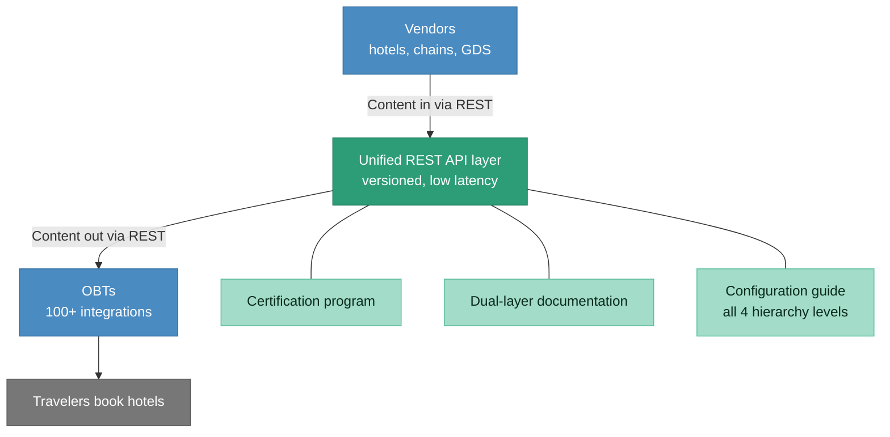
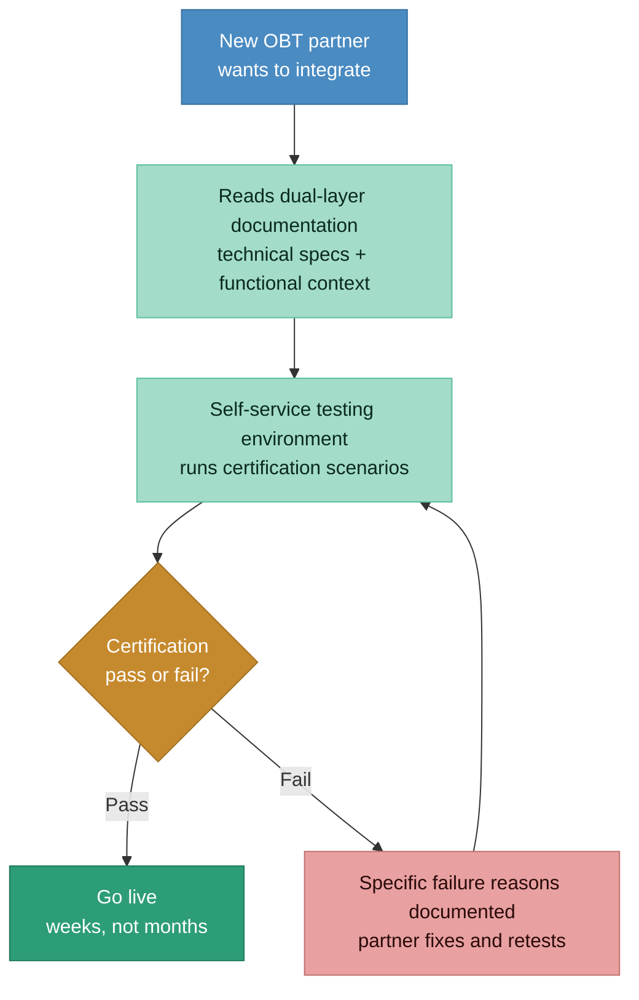
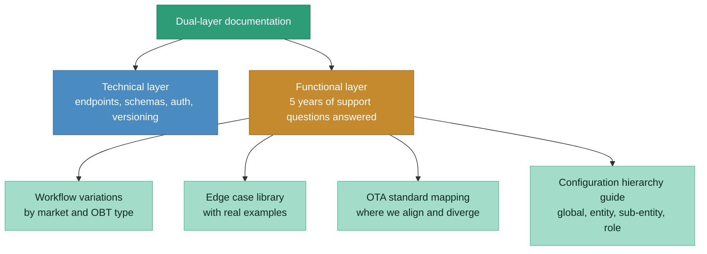

# After state: REST APIs, certification program, self-serve documentation

> 80% latency reduction. Onboarding cut from months to weeks. Documentation that pre-answers 5 years of support tickets. Certification as the standard for all new integrations.

### New onboarding flow

### Documentation architecture

## Before vs. after comparison

| Dimension | Before | After |
|-----------|--------|-------|
| **API protocol** | Mix of SOAP and REST in production | Unified REST. SOAP deprecated with parallel support during migration. |
| **Latency** | SOAP endpoints significantly slower | 80% reduction in API latency |
| **OBT onboarding time** | 2-6 months | 2-2.5 months (weeks for standard workflows) |
| **Documentation** | Technical specs only, happy path | Dual-layer: technical specs + functional documentation with 5 years of Q&A |
| **Edge cases** | Lived in engineers' heads | Documented edge case library with real examples |
| **Certification** | No formal process. Subjective "it works" sign-off. | Standardized certification with pass/fail criteria and self-service testing |
| **Configuration docs** | Poorly documented | Full hierarchy guide: global, entity, sub-entity, role-level rules |
| **OTA standard context** | Not documented | Explicit mapping showing alignment and divergences from OTA |
| **Support ticket volume** | High. Same questions repeated every integration. | Significantly reduced. Partners self-serve via documentation. |
| **User adoption** | Baseline | 35% increase across DACH and Europe |
| **Engineering time on support** | Major drain. Hours per week on recurring questions. | Freed up for new partnerships and product improvements. |

## Key architectural decisions

**Why dual-layer documentation, not just better API specs:**
API specs (endpoints, schemas, auth) are necessary but not sufficient. Partners needed functional context: why does a booking workflow in Germany differ from France? What happens when a vendor sends content our system doesn't recognize? How does the configuration hierarchy filter responses? These questions can't be answered by an OpenAPI spec. The functional layer addressed the questions that actually caused integration delays.

**Why a certification program, not just faster support:**
Faster support treats the symptom (partners waiting for answers). Certification treats the cause (ambiguity about what "working" means). By defining standardized test scenarios with binary pass/fail outcomes, we eliminated the subjective back-and-forth that dragged out every integration. Partners could self-test, fail fast, fix specific issues, and retest without waiting for our team.

**Why parallel SOAP/REST support during migration:**
Forcing partners to migrate on our timeline would have damaged relationships with our largest integrations. Some OBTs have annual release cycles. Some GDS systems move even slower. Parallel support was expensive (maintaining two protocol versions), but it was the only way to migrate without breaking trust. The cost was bounded (we knew when SOAP would sunset) and the payoff was permanent (80% latency reduction, cleaner versioning, easier maintenance).

**Why OTA standard mapping mattered:**
Most partners in the travel industry are familiar with OTA (Open Travel Alliance) standards. Our APIs mostly aligned with OTA but diverged in specific areas. Without documenting where we aligned and where we didn't, every partner had to discover the divergences through trial and error during integration. Explicitly calling out "we follow OTA for X, but we do Y differently because Z" saved weeks per integration.
