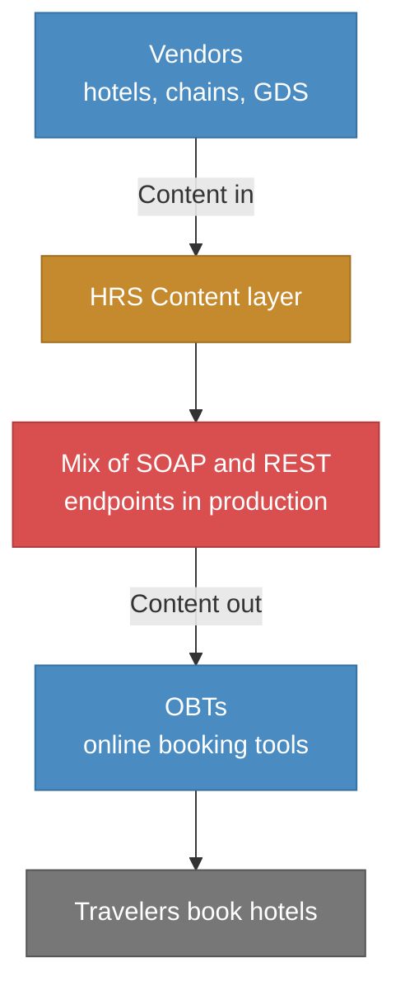
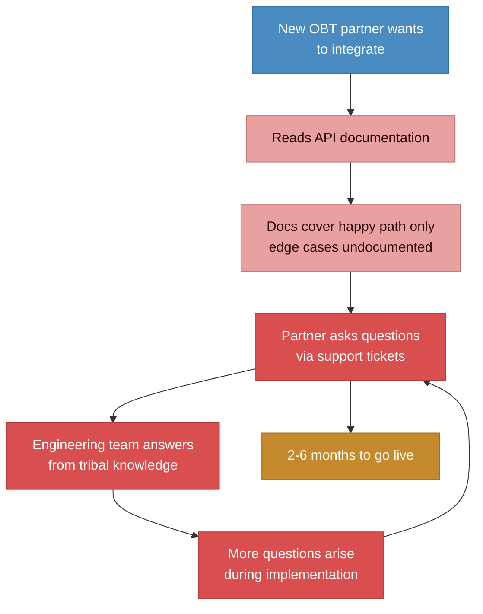
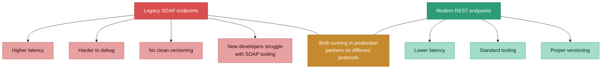

# Before state: legacy APIs, slow onboarding, tribal knowledge

> 100+ OBT integrations, 20+ vendor integrations, SOAP still in production, onboarding taking 2-6 months, and 5 years of support questions living in people's heads.

### The onboarding bottleneck

### SOAP vs. REST: the technical debt

## Pain points summary

| Problem | Impact |
|---------|--------|
| **SOAP endpoints still in production** | Higher latency, harder debugging, no clean versioning. New developers avoid SOAP tooling. |
| **Onboarding takes 2-6 months** | Extensive back-and-forth on edge cases, workflow variations, and configuration behavior. Every integration repeats the same questions. |
| **Documentation covers only happy path** | 5 years of recurring support questions live in senior engineers' heads, not in docs. Partners can't self-serve. |
| **No formal certification process** | "It works on our end" debates. No standardized pass/fail criteria. Going live is subjective. |
| **Configuration hierarchy undocumented** | Partners don't understand how global, entity, sub-entity, and role-level rules interact to filter API responses. Causes integration bugs. |
| **Vendor onboarding even slower** | Content sanitization adds significant time on top of workflow integration. Checking if content comes in cleanly is a manual, lengthy process. |
| **Engineering time consumed by support** | Every hour answering partner questions is an hour not spent on new partnerships or product improvements. |
